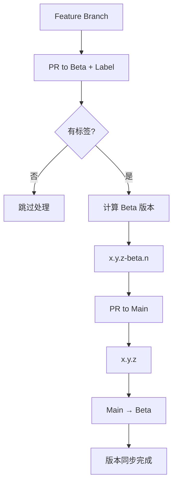

# 版本管理 GitHub Action

[](https://github.com/Yuxu-Palace/yuheng-dispatch/releases)
[](https://github.com/Yuxu-Palace/yuheng-dispatch/blob/main/LICENSE)

一个专门为语义化版本管理设计的 GitHub Action。支持 Beta/Main 两级分支管理策略，提供智能版本推导和 CHANGELOG 生成功能。

## 🌟 核心特性

- **🔄 两级分支管理**：支持 beta → main 分支策略
- **🏷️ 智能版本推导**：基于 PR 标签和分支关系自动计算版本
- **📝 CHANGELOG 生成**：基于 PR 信息自动生成变更日志
- **🔗 分支同步**：自动同步版本到下游分支，智能冲突解决
- **💬 PR 评论**：实时预览版本变更，提供详细的版本信息

## 📋 版本管理规则

### Beta 分支 (`beta`)
- **触发条件**：PR 必须包含标签 (`major`, `minor`, `patch`)，无标签则跳过
- **源分支**：接受来自任意功能分支（`feature/*`, `bugfix/*`, `hotfix/*` 等）的合并
- **版本计算规则**：
  1. 基于标签类型推导目标基础版本号（从 main 分支版本 + 标签）
  2. 比较推导版本与当前 beta 版本：
     - **高于当前版本**：修改基础号，重置测试号（`x.y.z-beta.0`）
     - **低于等于当前版本**：只增加测试号计数（`x.y.z-beta.n++`）

```
示例：
Main: v1.0.0, Beta: v1.1.0-beta.2
PR 标签: minor → 目标: v1.1.0 ≤ v1.1.0 → 结果: v1.1.0-beta.3

Main: v1.0.0, Beta: v1.1.0-beta.2
PR 标签: major → 目标: v2.0.0 > v1.1.0 → 结果: v2.0.0-beta.0
```

### Main 分支 (`main`)
- **源分支限制**：只接受来自 Beta 分支的合并
- **版本转换**：去除预发布标识，发布正式版本（`x.y.z-beta.n` → `x.y.z`）

### 分支同步策略
- **Main → Beta**：使用 `rebase` 同步
- **智能冲突处理**：自动创建 Issue 记录无法解决的冲突

## 🚀 快速开始

### 1. 基本配置

在您的项目中创建 `.github/workflows/version-management.yml`：

```yaml
name: 版本管理

on:
  pull_request:
    branches: [main, beta]
    types: [opened, synchronize, reopened, labeled, unlabeled, closed]

jobs:
  version-management:
    runs-on: ubuntu-latest
    permissions:
      contents: write
      issues: write
      pull-requests: write

    steps:
      - name: Checkout
        uses: actions/checkout@v4
        with:
          fetch-depth: 0

      - name: 版本管理
        uses: Yuxu-Palace/yuheng-dispatch@main
        with:
          token: ${{ secrets.GITHUB_TOKEN }}

          # 版本管理配置
          version-prefix: 'v'
          supported-branches: 'main,beta'
          enable-changelog: 'true'
```

### 2. PR 标签配置

在您的仓库中创建以下标签：

- `major`：主版本更新（破坏性变更）
- `minor`：次版本更新（新增功能）
- `patch`：补丁版本更新（bug 修复）

## 📖 使用示例

### Beta 分支开发流程

```bash
# 1. 创建功能分支
git checkout -b feature/new-api beta
# ... 开发新功能

# 2. 创建 PR 到 beta 分支，添加 minor 标签
# Action 将自动：
# - 计算新版本：v1.2.0-beta.0
# - 更新 package.json 和 CHANGELOG
# - 创建版本标签

# 3. 继续迭代
# 后续 PR 如果标签相同，将递增测试号：v1.2.0-beta.1
```

### Main 分支发布流程

```bash
# Beta 测试完成，创建 PR：beta → main
# Action 将自动：
# - 发布正式版本：v1.2.0
# - 同步代码到 beta 分支
```

## 💬 PR 评论输出

Action 会在 PR 中自动创建评论，显示版本管理信息：

### 版本预览评论
当 PR 有版本标签时，会显示版本预览：

```markdown
## 📦 版本管理

| 项目 | 值 |
|------|-----|
| **源分支** | `feature/new-api` |
| **目标分支** | `beta` |
| **当前版本** | `v1.0.0-beta.1` |
| **下一版本** | `v1.1.0-beta.0` |

> ℹ️ 这是预览模式，合并 PR 后将自动创建 tag 并更新版本。
```

### 跳过处理评论
当 PR 无需版本升级时：

```markdown
## 📦 版本管理

| 项目 | 值 |
|------|-----|
| **目标分支** | `beta` |
| **当前版本** | `v1.0.0-beta.1` |
| **状态** | `跳过 - 无需升级` |

> ℹ️ 根据当前分支状态和标签，无需进行版本升级。
```

### 错误评论
当遇到错误时：

```markdown
## 📦 版本管理

❌ **错误信息**

Beta 分支需要 PR 标签（major/minor/patch）来确定版本升级类型。

> 请在 PR 上添加合适的版本标签。
```

## ⚙️ 配置参数

### 基础配置

| 参数 | 描述 | 必需 | 默认值 |
|------|------|------|--------|
| `token` | GitHub token | ✅ | - |
| `version-prefix` | 版本标签前缀 | ❌ | `v` |
| `git-user-name` | Git 提交用户名 | ❌ | `GitHub Action` |
| `git-user-email` | Git 提交邮箱 | ❌ | `action@github.com` |
| `supported-branches` | 支持的分支列表 | ❌ | `main,beta` |
| `enable-changelog` | 启用 CHANGELOG 生成 | ❌ | `true` |
| `comment-title` | PR 评论标题 | ❌ | `📦 版本管理` |

### 输出参数

| 输出 | 描述 |
|------|------|
| `next-version` | 计算出的新版本号 |
| `preview-version` | 预览版本号 |
| `is-preview` | 是否为预览模式 |

## 🔧 高级配置

### 自定义版本前缀

```yaml
version-prefix: 'rel-'  # 生成标签：rel-1.0.0
```

### 多分支支持

```yaml
supported-branches: 'main,beta,staging'
```

## 📚 工作流程图



## 🤝 分支策略最佳实践

### 开发流程建议

1. **功能开发**：在 beta 分支进行新功能开发
2. **生产发布**：测试完成后合并到 main 发布生产版本
3. **热修复**：在对应环境分支创建修复分支

### 标签使用建议

- `major`：API 破坏性变更、架构重构
- `minor`：新增功能、新增 API
- `patch`：bug 修复、性能优化、文档更新

## 📝 故障排除

### 常见问题

1. **版本计算错误**
   - 检查分支标签是否正确
   - 确认 PR 来源和目标分支符合规则

2. **分支同步冲突**
   - Action 会自动创建 Issue 记录冲突
   - 手动解决冲突后重新运行


## 🏗️ 本地开发

### 环境要求

- Node.js 20+
- pnpm 10+

### 安装依赖

```bash
pnpm install
```

### 构建

```bash
pnpm build
```

### 代码格式化

```bash
pnpm check
pnpm format
```

## 📄 许可证

MIT License - 详见 [LICENSE](LICENSE) 文件。

## 🤝 贡献

欢迎提交 Issue 和 Pull Request！请确保：

1. 遵循现有代码风格
2. 添加适当的测试
3. 更新相关文档

---

如有问题，请在 [Issues](https://github.com/Yuxu-Palace/yuheng-dispatch/issues) 中反馈。